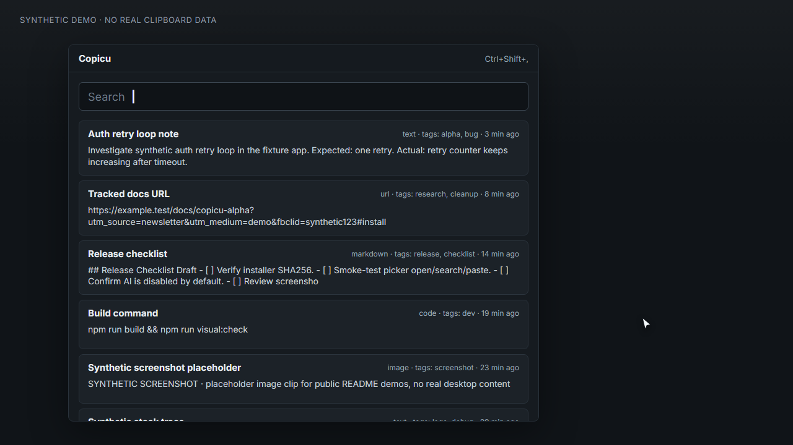
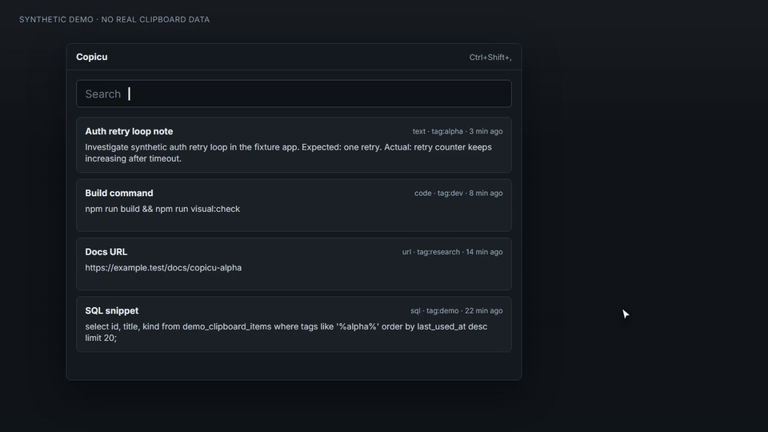

# Copicu

**Copicu is a local-first, scriptable clipboard manager for Windows power users.**

It turns clipboard history into working memory: search it, preview it, organize it with metadata, run local actions over it, and paste useful fragments back into the app you came from.

Copicu is Windows-first today. It is inspired by advanced clipboard tools like CopyQ, but it is not a CopyQ-compatible clone and does not try to run CopyQ scripts.

## Demo

These assets use generated synthetic clipboard data only.



Short generated flow:



Static poster: [docs/assets/screenshots/copicu-synthetic-picker-demo-poster.png](docs/assets/screenshots/copicu-synthetic-picker-demo-poster.png)  
Video: [docs/assets/videos/copicu-synthetic-picker-demo.mp4](docs/assets/videos/copicu-synthetic-picker-demo.mp4)

More real-looking synthetic workflow demos are planned before the next public feedback push.

## Install The Windows Alpha

1. Download the latest Windows installer from [GitHub Releases](https://github.com/jpsala/copicu/releases).
2. Run the `Copicu_*_x64-setup.exe` installer.
3. Open Copicu, copy a few non-sensitive test clips, then use the picker to search, copy, edit, tag, or paste them.

Current release:

- [v0.3.2](https://github.com/jpsala/copicu/releases/tag/v0.3.2)
- Asset: `Copicu_0.3.2_x64-setup.exe`
- Windows x64 NSIS installer
- SHA256: `2E38ABC686DAD94F16DAAE16C2671F49281A5A84FCEDA3D14EF93D48E565110A`

Autostart settings hardening: Settings now reads the real Windows startup state and blocks dev builds from overwriting installed autostart.

Copicu is used daily by its maintainer, but it is still alpha software. Windows may show SmartScreen or Defender warnings for a young/unsigned desktop app that monitors clipboard and keyboard shortcuts. Verify downloads from GitHub Releases and the published SHA256.

## Why Use It?

Power users copy useful fragments all day:

- code snippets and terminal commands;
- URLs, research links, prompts, and partial answers;
- error messages, stack traces, and logs;
- Markdown fragments, chat drafts, and notes;
- screenshots and image-only clipboard items;
- text that needs cleanup, tagging, formatting, or reuse.

Most clipboard managers help you remember those fragments. Copicu is meant to help you **do something with them**.

The long-term direction:

> Search your clipboard like a history, organize it like a workspace, automate it like a tool, and command it like an assistant.

## What It Can Do Today

Copicu is early-stage, but the core is functional:

- capture clipboard history for text;
- capture image-only clipboard items as normalized PNG blobs;
- store history and metadata locally with SQLite;
- store image/blob payloads outside SQLite;
- deduplicate content by hash;
- open a compact searchable picker;
- navigate primarily with the keyboard;
- search plain text or scoped fields like `meta:`, `title:`, `notes:`, `ctx:`, `tag:`, `kind:`, and `is:marked`;
- choose whether search runs in realtime, on Enter, or only from the Search button;
- copy the selected item;
- paste the selected item into the previous Windows app;
- edit item content and metadata;
- add titles, tags, notes, and MIME hints;
- assign metadata from the picker with `Ctrl+Shift+C`, including batch append/replace/merge for multi-selection;
- open tag-filtered picker routes;
- run built-in actions and trusted local TypeScript/JavaScript scripts;
- use a command palette and local/global shortcut routes;
- optionally use AI-assisted search/actions when configured by the user;
- show Markdown output windows for generated summaries, reports, drafts, or script results.

## Core Flows

### 1. Search, Filter, And Paste

Open the picker, type a few characters, select a previous clip, then copy it or paste it into the app you were using before opening Copicu.

Useful query examples:

- `meta:client` searches visible editable metadata: title, notes, and tags.
- `title:invoice` searches the editable item title.
- `notes:followup -meta:draft` combines scoped and negated filters.
- `ctx:vivaldi` searches hidden capture context such as source app/window/URL metadata.
- `window:pull request` searches captured source window titles. `title:` is reserved for the editable item title.

The picker can filter while typing, wait for Enter, or wait for the Search button. `Ctrl+Enter` runs the current query in any mode.

Paste-to-previous-window is intentionally Windows-first and depends on native focus behavior, target app timing, and paste shortcuts. Please report target-specific failures with synthetic reproduction data.

### 2. Organize Clipboard Working Memory

Copicu clips can carry structured metadata:

- title;
- tags;
- notes;
- MIME hints;
- generated or edited content.

Visible metadata is user-editable and searchable with `meta:`, `title:`, and `notes:`. Capture context is separate: Copicu may store hidden source information such as app, window, URL/domain, and clipboard format hints so `ctx:`/`window:` searches can find where a clip came from without mixing that provenance into your editable title or notes.

This makes the clipboard useful for recurring snippets, links, prompts, code, screenshots, and temporary project notes instead of being just a flat list.

### 3. Run Local Actions And Scripts

Copicu has a shared concept called an **Action**. Actions can be built in or provided by local TypeScript/JavaScript scripts.

Example workflows:

- clean tracking parameters from URLs;
- format JSON before pasting;
- normalize whitespace;
- join checked clips into Markdown;
- extract URLs from selected clips;
- tag selected clips;
- paste transformed content into the previous app;
- create a Markdown summary from checked items.

The repo already includes runnable showcase examples under [scripts/examples/](scripts/examples/). Copy them to your Copicu scripts folder, refresh diagnostics in Settings, then run them from the item menu, command palette, or local shortcuts while the picker is focused:

- [clean URL tracking parameters](scripts/examples/028-clean-url-tracking-copy.ts) — `Ctrl+Alt+U`;
- [format selected JSON](scripts/examples/029-format-json-copy.ts) — `Ctrl+Alt+F`;
- [normalize whitespace and copy](scripts/examples/010-normalize-whitespace-copy.ts) — `Ctrl+Alt+N`;
- [extract URLs from selected text](scripts/examples/030-extract-urls-copy.ts) — `Ctrl+Alt+L`;
- [join selected clips as Markdown](scripts/examples/031-join-selected-markdown-copy.ts) — `Ctrl+Alt+M`.

Press `Ctrl+Alt+Q` in the picker to open **Quick Actions**, a context-aware action picker that shows runnable scripts/actions for the current selection so you do not need to memorize every shortcut.

Scripts are trusted local automation, not a secure sandbox or marketplace. Treat scripts like code you choose to run on your own machine.

Read the scripting guide: [docs/user/scripts.md](docs/user/scripts.md)

## Privacy Model

Clipboard history is sensitive. Copicu is local-first by design:

- clipboard history metadata lives in local SQLite;
- image and blob payloads live in local files;
- scripts are local files;
- examples, screenshots, tests, and issues should use synthetic data;
- real clipboard dumps, local databases, `.env` files, secrets, and private logs should never be committed.

AI features are optional and disabled by default. Some AI operations, such as search planning, can translate a natural-language request into local filters like `meta:`/`ctx:` without sending clipboard payloads. Other operations, such as summarizing selected clips, necessarily send selected content to the configured provider and should remain explicit, capability-based, and reviewable.

Use [.env.example](.env.example) if you want to test OpenAI-compatible providers locally.

## How It Compares

This table is intentionally conservative. Copicu is much younger than the established tools.

| Area | Copicu | CopyQ | Ditto | PasteBar |
| --- | --- | --- | --- | --- |
| Primary focus today | Windows-first local clipboard working memory | Mature cross-platform power-user clipboard manager | Mature Windows clipboard history | Modern organized clipboard manager |
| Maturity | Alpha, active development | Mature | Mature | More mature than Copicu |
| Storage model | Local SQLite metadata + local blob files | Local app storage | Local database | Local app storage |
| Keyboard-first picker | Core product surface | Supported | Supported | Supported |
| Paste to previous Windows app | Core Windows flow, still being hardened | Supported via mature app behavior | Supported | Supported |
| Metadata | Titles, tags, notes, MIME hints | Rich item organization | Simpler history model | Collections/organization |
| Scripting/actions | Trusted local TS/JS actions and host APIs | Powerful CopyQ scripting | Limited/plugin-oriented | App-specific automation/features |
| AI | Optional, disabled by default, explicit selected-content actions | Not the core pitch | Not the core pitch | Depends on app features |
| Compatibility stance | Inspired by CopyQ, not script-compatible | Canonical CopyQ behavior | Ditto ecosystem | PasteBar ecosystem |

If you already love CopyQ or Ditto, you may not need Copicu. Copicu is for people who want a modern Windows-first clipboard tool with structured metadata, local scripts/actions, and a privacy-aware path toward optional AI operations.

## Large Histories

Copicu is designed so the picker does not become a giant React DOM list.

The current architecture uses SQLite for local history/metadata and paginated queries, while `@tanstack/react-virtual` renders only visible rows plus a small overscan buffer.

This is a design direction, not an unlimited-history benchmark claim. Storage size, indexes, blob payloads, thumbnails, retention policy, preview generation, and query shape still matter. Public benchmarks are planned before making stronger performance claims.

## Current Limitations

Known limitations:

- Windows is the primary tested platform right now.
- APIs, settings, script contracts, search syntax, and UI behavior can still change.
- `title:` means editable item title; captured source window title search uses `window:` or broader context filters.
- Metadata provenance/origin is still evolving; not every captured context field is exposed as an editable property.
- Paste-to-previous-window depends on Windows focus behavior, target apps, timing, and paste shortcuts.
- Scripts are trusted local automation, not a secure sandbox or marketplace.
- AI is optional and disabled by default; selected-content AI actions may send selected clipboard content to the configured provider.
- Rich clipboard formats are still evolving. Text and image-only capture exist, but full HTML/RTF/custom-format fidelity is not a compatibility promise.
- Copicu does not run CopyQ scripts or promise full CopyQ parity.
- Windows code signing and package-manager distribution are still being improved.

Good feedback includes Windows version, target app, install method, Copicu version or commit, exact steps, and synthetic reproduction data.

Please do not paste real clipboard payloads into issues. Reduce examples to synthetic data.

## What To Test And Report

The most useful reports are narrow and reproducible:

- clipboard capture from common Windows apps;
- paste-to-previous-window behavior in specific target apps;
- shortcut, tray, hide/show, and focus behavior;
- picker search, keyboard navigation, and preview readability;
- script/action ideas that would save real daily effort;
- optional AI command mode friction, using only synthetic or non-sensitive clips;
- performance symptoms with large synthetic histories.

Open an issue using the templates in this repo and include synthetic reproduction data whenever possible.

## Roadmap

Near-term priorities:

- stronger paste-to-previous-window validation across target apps;
- query explain/chips so scoped search results are easier to understand;
- more built-in actions and sample scripts;
- a stable script/action API;
- richer previews for text, code, URLs, HTML, Markdown, and images;
- better tags, saved filters, and smart collections;
- public benchmark plan for large histories;
- clearer Windows packaging and distribution;
- cross-platform support only where native behavior can be made reliable.

See also: [docs/tracks/018-public-launch-readiness.md](docs/tracks/018-public-launch-readiness.md)

## Development

Requirements:

- Node.js/npm;
- Rust;
- Tauri 2 prerequisites for your platform;
- WebView2 on Windows.

Common commands:

```powershell
npm install
npm run build
npm run visual:check
npm run rust:test
npm run tauri:dev
```

Build the desktop app:

```powershell
npm run tauri:build
```

AI setup for local development:

```powershell
Copy-Item .env.example .env
# then edit .env and set COPICU_AI_API_KEY
```

Local Windows release helper:

```powershell
npm run release:windows
# Optional: npm run release:windows -- -Bump minor -Notes "Windows installer refresh."
```

## Contributing

Contributions are welcome, especially around:

- clipboard capture reliability;
- Windows focus and paste behavior;
- built-in actions and script examples;
- rich MIME, HTML, RTF, and image handling;
- picker UX and accessibility;
- search, filtering, tags, and metadata;
- public screenshots/GIFs with synthetic data;
- packaging, release notes, and distribution;
- tests and documentation.

Please read [CONTRIBUTING.md](CONTRIBUTING.md) before opening a pull request. Before starting a large feature, open an issue or discussion.

## Documentation

User-facing docs:

- [docs/user/README.md](docs/user/README.md)
- [docs/user/scripts.md](docs/user/scripts.md)

Project and contributor docs:

- [CONTRIBUTING.md](CONTRIBUTING.md)
- [docs/README.md](docs/README.md)
- [docs/PROJECT.md](docs/PROJECT.md)
- [docs/DEVELOPMENT.md](docs/DEVELOPMENT.md)
- [docs/TOPICS.md](docs/TOPICS.md)

## Name

The name **Copicu** comes from the CopyQ inspiration without claiming compatibility. It is a separate project with its own product direction: local clipboard intelligence, structured metadata, personal automation, and optional AI-assisted actions.
