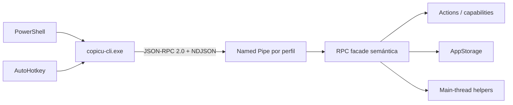

# Local RPC And CLI

## Objetivo

Exponer una API local, versionada y automatizable de Copicu para PowerShell y AutoHotkey sin abrir puertos, SQL, comandos Tauri arbitrarios ni una segunda implementación de Actions.

El corte debe cerrarse de extremo a extremo en una sola sesión de implementación siempre que no aparezca un bloqueo nativo real. La única pausa prevista es el gate explícito antes de ejecutar `npm run install:current`, porque reemplaza y relanza la app instalada.



## Decisiones Cerradas Para V1

- Transporte: Windows Named Pipe local. No TCP/HTTP/COM/`WM_COPYDATA`.
- Wire format: JSON-RPC 2.0 sobre UTF-8 NDJSON, un request y como máximo una response por conexión.
- Seguridad: DACL explícita para el logon SID actual y LocalSystem, más `PIPE_REJECT_REMOTE_CLIENTS`. El nombre del pipe no es un secreto.
- Identidad de perfil: hash estable del app-data efectivo. `COPICU_APP_DATA_DIR` y `--app-data-dir` usan la misma regla; instalada y dev nunca comparten endpoint.
- Cliente: `copicu-cli.exe`, binario consola separado dentro del package Cargo. `copicu.exe` conserva `windows_subsystem = "windows"`.
- Concurrencia inicial: un executor RPC serial fuera del main thread. Una action larga puede ocupar RPC, pero no bloquear picker, clipboard watcher ni event loop Tauri.
- Lifecycle: Copicu app es el servidor. V1 no auto-lanza la app; el CLI falla rápido y claramente si el perfil no está activo.
- Dependencias: ninguna crate nueva. Ampliar features de `windows = 0.62.2` solamente.
- Distribución: instalar `copicu-cli.exe` junto a `%LOCALAPPDATA%\Copicu\copicu.exe`. No modificar `PATH` ni aliases del usuario.
- Compatibilidad: protocolo `v1`; cambios incompatibles requieren un nuevo nombre de pipe/protocol version.
- Scope RPC V1:
  - `system.ping`
  - `picker.show`
  - `history.search`
  - `actions.list`
  - `actions.run`
- `actions.run` siempre construye `Trigger::Cli`; el caller no puede elegir otro trigger, capabilities o métodos Host arbitrarios.

## No Objetivos V1

- No exponer SQLite, filesystem, shell, network, Tauri `invoke` ni `hostCall(method)` genérico.
- No `history.delete`, settings mutation, clipboard raw, quit, update/install ni otras operaciones destructivas.
- No batch JSON-RPC, notifications, conexiones persistentes, streaming ni multiplexing.
- No concurrencia ilimitada ni Tokio.
- No auto-start de Copicu, service Windows, elevación, acceso remoto o cambios de firewall.
- No compatibilidad completa con CopyQ ni protocolo público multiplataforma todavía.

# Phase 0: Documentation Discovery

Estado: completa para planificar.

## Fuentes Locales Consultadas

- `docs/topics/actions-and-scripting-api.md:27-71`: Actions, Host API y capabilities son la autoridad; no SQL/shell/fs/network crudo.
- `docs/tracks/004-actions-scripting.md`: runner Node NDJSON existente y riesgos históricos de main-thread.
- `src-tauri/src/actions/model.rs:57-148`: `Trigger::Cli`, `ActionContext` y `RunActionRequest` ya existen.
- `src-tauri/src/actions/discovery.rs:452-457`: manifests ya aceptan `"cli"`.
- `src-tauri/src/actions.rs:85-763`: `actions::run_action` es el dispatcher reusable; helpers UI ya despachan al main thread.
- `src-tauri/src/actions.rs:1228-1270,1685-1928`: capability gate y protocolo NDJSON interno del runner; copiar sus invariantes, no acoplar transportes.
- `src-tauri/src/actions.rs:1390-1417`: semántica vigente de `history.search` sobre `AppStorage::history_search`.
- `src-tauri/src/actions/capabilities.rs:1-104`: vocabulario único de permisos.
- `src-tauri/src/lib.rs:3126-3247,5590-5665`: setup Tauri y patrón backend-thread para ejecutar Actions.
- `src-tauri/src/storage.rs:69-76,1739-1810`: storage compartido serializado y búsqueda estructurada.
- `src-tauri/src/main.rs:1-10`: el binario GUI no puede reutilizarse como CLI consola.
- `src-tauri/Cargo.toml:1-46`: `autobins=false`, un solo binario actual, `serde_json`, `sha2` y `windows` disponibles.
- `scripts/dev/isolated-dev.ps1:1-43`: perfil dev aislado autoritativo.
- `docs/topics/windows-installer.md:82-107,243-268`: patrón de resource/hook NSIS, binario GUI y separación instalada/dev.
- `src-tauri/nsis-hooks.nsh:1-20`: patrón copiable para mover un resource junto al ejecutable y borrarlo al desinstalar.
- Tauri v2, Embedding External Binaries: <https://v2.tauri.app/develop/sidecar/>.
- Microsoft `CreateNamedPipeW`: <https://learn.microsoft.com/en-us/windows/win32/api/namedpipeapi/nf-namedpipeapi-createnamedpipew>.
- Microsoft `ConnectNamedPipe`: <https://learn.microsoft.com/en-us/windows/win32/api/namedpipeapi/nf-namedpipeapi-connectnamedpipe>.
- Microsoft Named Pipe Security: <https://learn.microsoft.com/en-us/windows/win32/ipc/named-pipe-security-and-access-rights>.
- JSON-RPC 2.0: <https://www.jsonrpc.org/specification>.

## Allowed APIs

- `CreateNamedPipeW`, `ConnectNamedPipe`, `DisconnectNamedPipe`, `WaitNamedPipeW` de `Win32_System_Pipes`.
- `CreateFileW`, `ReadFile`, `WriteFile` de `Win32_Storage_FileSystem`.
- `OVERLAPPED`, `CancelIoEx` de `Win32_System_IO`.
- `CreateEventW`, `WaitForSingleObject`, `OpenProcessToken`, `GetTokenInformation`, `CloseHandle` mediante las features Windows correspondientes.
- `ConvertStringSecurityDescriptorToSecurityDescriptorW` o `SetEntriesInAclW` para una DACL explícita. Elegir una sola ruta y encapsular ownership/`LocalFree` con RAII.
- `PIPE_ACCESS_DUPLEX | FILE_FLAG_FIRST_PIPE_INSTANCE | FILE_FLAG_OVERLAPPED`.
- `PIPE_TYPE_BYTE | PIPE_READMODE_BYTE | PIPE_WAIT | PIPE_REJECT_REMOTE_CLIENTS`.
- `actions::run_action`, `AppStorage::history_search`, helpers main-thread existentes y modelos Actions vigentes.

## Anti-APIs / Guardas

- `lpSecurityAttributes = None` no es user-only: el descriptor default concede lectura a Everyone y anonymous.
- `PIPE_NOWAIT` no es async; Microsoft lo conserva por compatibilidad. Usar overlapped I/O.
- No existe `std::os::windows::net::NamedPipe`.
- JSON-RPC no define framing, tamaños, deadlines ni shutdown; Copicu debe especificarlos.
- No usar `CallNamedPipeW`, un pipe remoto, un nombre secreto, PID o token en command line como autorización.
- No reutilizar el gateway Host API sin el capability check ligado a una `ActionDefinition`.

# Contrato V1

## Endpoint

El servidor y el CLI calculan:

```text
profile_key = lowercase(normalized_absolute_app_data_dir)
profile_id  = first_16_hex(sha256(profile_key))
pipe_name   = \\.\pipe\copicu-rpc-v1-<profile_id>
```

Precedencia del app-data del CLI:

1. `--app-data-dir <path>`;
2. `COPICU_APP_DATA_DIR`;
3. `%APPDATA%\dev.jpsala.copicu`.

La response de `system.ping` devuelve `protocolVersion`, `appVersion`, `profileId` y `methods`, nunca la ruta completa.

## Framing Y Límites

- Un JSON object UTF-8 compacto terminado en LF por request/response; aceptar CRLF.
- Una conexión procesa exactamente un request y luego cierra.
- Request y response máximos: 1 MiB cada uno.
- Request transport deadline: 5 s. `actions.run` conserva el timeout interno vigente de 15 s; cliente permite 20 s totales.
- Arrays/batch y notifications se rechazan como `Invalid Request`; V1 exige `id` string o integer.
- Lecturas y escrituras siempre iteran hasta frame/completion; EOF con frame incompleto es error y no ejecuta nada.

## Errores

Mantener códigos JSON-RPC estándar:

- `-32700` parse error;
- `-32600` invalid request;
- `-32601` method not found;
- `-32602` invalid params;
- `-32603` internal error.

Códigos server V1:

- `-32010` Copicu state unavailable;
- `-32020` action rejected by trigger/input/capability policy;
- `-32021` action execution failed;
- `-32030` operation timed out;
- `-32040` response exceeds limit.

CLI exit codes:

- `0`: JSON-RPC success;
- `2`: argumentos CLI inválidos;
- `3`: pipe unavailable/timeout;
- `4`: framing/protocol error;
- `5`: JSON-RPC error response.

Stdout contiene solo JSON. Ayuda y errores de transporte van a stderr. `--pretty` cambia indentación, no schema.

## Métodos

### `system.ping`

Params: `{}`.

Result:

```json
{
  "protocolVersion": 1,
  "appVersion": "0.4.7",
  "profileId": "…",
  "methods": ["system.ping", "picker.show", "history.search", "actions.list", "actions.run"]
}
```

### `picker.show`

Params: `{}`. Usa el helper host-owned vigente para mostrar/enfocar el picker y responde solo después de que el main thread acepte la operación.

### `history.search`

Params:

```json
{"query":"tag:work kind:text","limit":20,"content":false}
```

- `limit` default 20, rango 1..100.
- `content` default false y requiere opción CLI explícita `--content`.
- Copiar la semántica y DTO de `script_history_search`; extraer helper compartido en vez de duplicar normalización/serialización.

### `actions.list`

Params: `{}`. Devuelve solo acciones sin diagnostics error cuyo manifest declara `cli`; no expone source paths salvo los campos ya públicos de `ActionDefinition` que se aprueben en la spec.

### `actions.run`

Params:

```json
{
  "actionId": "examples.toastHello",
  "currentItemId": 42,
  "selectedItemIds": [42, 43],
  "query": "tag:work"
}
```

- `currentItemId`, `selectedItemIds` y `query` son opcionales.
- Construir `ActionContext { trigger: Cli, shortcut: None, ... }` en Rust.
- No aceptar `trigger`, `capabilities`, `shortcut`, `hostMethod` ni payload arbitrario del caller.
- Seguir exigiendo que el manifest incluya `cli`; reutilizar validación de input/capabilities, logging y `ActionRunResult`.

## CLI V1

```powershell
& "$env:LOCALAPPDATA\Copicu\copicu-cli.exe" rpc ping
& "$env:LOCALAPPDATA\Copicu\copicu-cli.exe" picker show
& "$env:LOCALAPPDATA\Copicu\copicu-cli.exe" history search --query "tag:work" --limit 20
& "$env:LOCALAPPDATA\Copicu\copicu-cli.exe" action list
& "$env:LOCALAPPDATA\Copicu\copicu-cli.exe" action run examples.toastHello --item 42
```

Dev aislada:

```powershell
$env:COPICU_APP_DATA_DIR = "$PWD\.codex-run\dev-isolated\app-data"
& .\src-tauri\target\debug\copicu-cli.exe rpc ping | ConvertFrom-Json
```

AutoHotkey usa el CLI; no implementa Named Pipes directamente en V1:

```ahk
RunWait('"' A_LocalAppData '\Copicu\copicu-cli.exe" picker show',, 'Hide')
```

# Phase 1: Spec Y Contratos Compartidos

## Qué Implementar

1. Crear `specs/010-local-rpc-cli/spec.md` copiando los contratos cerrados de este track: scope, seguridad, profile routing, métodos, límites, errores, exit codes y aceptación.
2. Agregar tipos serde sin Tauri para JSON-RPC request/response/error, params/result y límites en `src-tauri/src/rpc/`.
3. Extraer una función pura de validación de request y dispatch table; mantener batch/notification fuera de V1.
4. Extraer de Actions únicamente el helper de resultado de `history.search` necesario para compartir DTO, sin hacer público el dispatcher Host genérico.
5. Hacer testeable la policy de triggers de scripts y agregar `Cli` a los triggers permitidos.

## Referencias Para Copiar

- Modelos camelCase: `src-tauri/src/actions/model.rs:57-148`.
- Framing/errores correlacionados existentes: `src-tauri/src/actions.rs:1228-1270,1685-1928`.
- Search payload/DTO: `src-tauri/src/actions.rs:1087-1094,1390-1417`.
- Spec Actions: `specs/004-actions-scripting-api/spec.md`.
- JSON-RPC 2.0: <https://www.jsonrpc.org/specification>.

## Verificación

- Unit tests para IDs string/integer, malformed JSON, object inválido, method desconocido, params inválidos, oversized frame y rechazo completo de batch/notification.
- Unit test que demuestra: manifest sin `cli` no ejecuta; manifest con `cli` llega a la policy permitida; `Tray` sigue sin habilitarse accidentalmente.
- `history.search` Host y RPC producen el mismo DTO para la misma fixture.

## Guardas

- No inventar un segundo modelo Action o capability vocabulary.
- No hacer `pub` APIs internas más allá del mínimo `pub(crate)` compartido.
- No devolver errores Rust/debug completos ni paths en responses.

# Phase 2: Named Pipe Seguro

## Qué Implementar

1. Ampliar features de la crate `windows` existente: Pipes, FileSystem, IO, Security y Security Authorization; no agregar crates.
2. Implementar wrappers RAII para pipe/event/token/security descriptor y un helper único de overlapped I/O con deadline/cancelación.
3. Obtener el logon SID del proceso, construir DACL protegida para logon SID + LocalSystem y pasar `SECURITY_ATTRIBUTES` explícito a `CreateNamedPipeW`.
4. Implementar server y client byte-mode NDJSON con límite 1 MiB y una request por conexión.
5. Derivar el pipe name desde el app-data efectivo con `sha2` y una función compartida por server/CLI.
6. Implementar `RpcServerHandle::stop`/`Drop`: señal de stop, `CancelIoEx`, completion y join; nunca dejar un listener colgado en tests o shutdown normal.
7. Proveer stubs `cfg(not(windows))` que devuelvan unsupported al compilar, sin fingir transporte multiplataforma.

## Referencias Para Copiar

- Dependencia existente: `src-tauri/Cargo.toml:21-40`.
- Profile dev: `scripts/dev/isolated-dev.ps1:1-43`.
- Profile instalada: `docs/topics/windows-installer.md:251-268`.
- APIs y seguridad Microsoft listadas en Phase 0.

## Verificación

- Server/client real en test con endpoint aleatorio: partial reads/writes, CRLF, disconnect, timeout y respuesta mayor al límite.
- Dos profile dirs generan pipes distintos; la misma ruta normalizada genera el mismo pipe.
- Una segunda `FILE_FLAG_FIRST_PIPE_INSTANCE` falla cerrada.
- Inspección del descriptor confirma DACL protegida y ACEs para logon SID + LocalSystem; no Everyone/anonymous.
- Repetir connect/stop en loop para detectar handles o threads colgados.

## Guardas

- No `SECURITY_ATTRIBUTES = None`, NULL DACL, Everyone o Authenticated Users.
- No bloquear main thread; no `PIPE_NOWAIT`; no `FlushFileBuffers` incondicional.
- Mantener buffers y `OVERLAPPED` vivos hasta completion/cancelación.
- Tratar `ERROR_PIPE_CONNECTED` como conexión válida y `ERROR_BROKEN_PIPE` como EOF normal.

# Phase 3: Facade RPC Y Actions CLI

## Qué Implementar

1. Iniciar el server al final de `setup`, después de manejar `AppStorage` y estados requeridos, en thread dedicado.
2. Implementar facade semántica exhaustiva para los cinco métodos V1; ningún passthrough por string hacia Tauri/Host API.
3. `system.ping`: datos no sensibles y lista exacta de métodos.
4. `picker.show`: copiar el helper host-owned existente y despachar solo la operación UI al main thread.
5. `history.search`: reutilizar `AppStorage::history_search` y el mapper compartido; validar limit/content antes de tocar storage.
6. `actions.list`: filtrar diagnostics y trigger `Cli`.
7. `actions.run`: copiar el patrón backend-thread de `run_global_script_shortcut`, construir `RunActionRequest` forzando `Cli` y llamar una sola vez a `actions::run_action`.
8. Serializar calls RPC en el listener inicial; no bloquear mutexes mientras se espera al main thread más allá de lo que ya hacen helpers vigentes.
9. Loguear solo lifecycle/method/status/elapsed/response-size; nunca params, query, content, item text o token/SID.

## Referencias Para Copiar

- `src-tauri/src/lib.rs:3126-3247`: orden de setup/managed states.
- `src-tauri/src/lib.rs:5590-5665`: ejecución Action desde backend thread.
- `src-tauri/src/actions.rs:85-763`: dispatcher y helpers UI.
- `src-tauri/src/actions/capabilities.rs:1-104`: capability authority.
- `src-tauri/src/storage.rs:1739-1810`: búsqueda estructurada.

## Verificación

- Facade con dependencies fakes para los cinco métodos y mapping exacto de errores.
- Integration test real: action con `triggers: ["cli"]` ejecuta; action equivalente sin `cli` devuelve `-32020`.
- Acción CLI que declara capability faltante conserva el error del gateway, redactado.
- `picker.show` se agenda/completa sin ejecutar el listener en main thread.
- Dos `actions.run` simultáneos se serializan en RPC; watcher/UI permanecen independientes.

## Guardas

- No abrir otra conexión SQLite desde RPC ni desde CLI.
- No duplicar runner Node, input validation, capability checks o action logging.
- No aceptar trigger/capabilities elegidos por el caller.
- No sostener el main thread esperando al runner Node.

# Phase 4: CLI Consola Y Distribución

## Qué Implementar

1. Declarar `[[bin]] name = "copicu-cli"` en Cargo y crear entrypoint consola sin `windows_subsystem = "windows"`.
2. Implementar parser pequeño con `std::env::args_os`; no agregar `clap`. Comandos y flags son exactamente los del contrato V1.
3. Resolver app-data con precedencia compartida y conectar al pipe; stdout JSON-only, stderr para ayuda/transporte, exit codes estables.
4. Agregar scripts package para build/smoke del CLI sin alterar `npm test` inexistente.
5. Compilar release CLI antes del bundle. Incluirlo como `bundle.resources` y copiarlo a `$INSTDIR\copicu-cli.exe` copiando el patrón `WebView2Loader.dll` del hook NSIS; borrarlo en uninstall.
6. Mantener `copicu.exe` como GUI. No agregar el CLI al PATH ni crear aliases/registry/protocol handlers.
7. Documentar ejemplos PowerShell/AutoHotkey en `docs/USER_GUIDE.md` y actualizar `actions-and-scripting-api.md`, `scripts/examples/copicu-action.d.ts`, track 004 y README de examples para `cli`.

## Referencias Para Copiar

- Cargo bins: `src-tauri/Cargo.toml:1-17`.
- GUI subsystem: `src-tauri/src/main.rs:1-10` y `docs/topics/windows-installer.md:89-107`.
- Bundle/hook: `src-tauri/tauri.conf.json`, `src-tauri/nsis-hooks.nsh:1-20`, `docs/topics/windows-installer.md:82-87`.
- Tauri sidecar/resource constraints: <https://v2.tauri.app/develop/sidecar/>.
- Tipos Action: `scripts/examples/copicu-action.d.ts`.

## Verificación

- `cargo build --bins`: GUI y CLI separados; CLI stdout se puede pipear a `ConvertFrom-Json`.
- CLI args inválidos/unknown command imprimen stderr y salen 2; app ausente sale 3 sin iniciar Tauri.
- Build NSIS contiene `copicu-cli.exe`; inspeccionar artifact antes de instalar.
- Tras autorización explícita para `npm run install:current`, comprobar `%LOCALAPPDATA%\Copicu\copicu-cli.exe`, `rpc ping` y uninstall hook en el artifact/config, sin ejecutar uninstall.

## Guardas

- No heredar `windows_subsystem="windows"` al CLI.
- No depender del cwd ni hardcodear el perfil dev.
- No escribir token, query o content en command line adicional, logs o archivos temporales.
- No instalar ni modificar PATH sin autorización separada.

# Phase 5: Verificación Automatizada Y Smoke Dev

## Orden De Checks

1. `cargo fmt --manifest-path src-tauri/Cargo.toml -- --check`.
2. `npm run build`.
3. `npm run rust:test`.
4. Tests RPC específicos con `--nocapture` solo si aportan diagnóstico.
5. `npm run context:refresh`.
6. `git diff --check`.
7. Reiniciar dev con `scripts/dev/restart-dev.ps1`; no dejar instancia vieja.

## Smoke Que Puede Ejecutar El Agente

Con dev aislada activa y el CLI debug apuntando al mismo `COPICU_APP_DATA_DIR`:

```powershell
$cli = '.\src-tauri\target\debug\copicu-cli.exe'
& $cli rpc ping | ConvertFrom-Json
& $cli action list | ConvertFrom-Json
& $cli history search --query '' --limit 2 | ConvertFrom-Json
& $cli picker show | ConvertFrom-Json
```

Además:

- perfil instalado/default no debe conectarse accidentalmente al dev pipe;
- malformed/raw request recibe el código exacto y no ejecuta método;
- Copicu detenido produce exit 3 dentro del deadline;
- `actions.run` usa una fixture efímera en dirs aislados y prueba success, missing `cli` y missing capability;
- repetir 20 calls secuenciales para detectar listener/handle inestable;
- confirmar en logs que no aparece query ni contenido.

## Smoke Manual Mínimo De JP

Solo queda valor humano en la ergonomía real del caller y foco Windows:

PowerShell:

```powershell
$r = & "$env:LOCALAPPDATA\Copicu\copicu-cli.exe" rpc ping | ConvertFrom-Json
$r.protocolVersion
```

AutoHotkey:

```ahk
RunWait('"' A_LocalAppData '\Copicu\copicu-cli.exe" picker show',, 'Hide')
```

Resultado esperado: el CLI no muestra consola persistente, AHK vuelve con exit code 0 y el picker aparece/enfoca. Si el agente puede ejecutar AutoHotkey determinísticamente por CLI, hace también este smoke; no necesita Computer Use salvo inspección visual pedida explícitamente.

## Guardas Finales

- No considerar aprobado solo porque compila: debe cruzar cliente real → pipe real → app real.
- No usar la DB instalada para smoke dev.
- No instalar/promover a instalada sin el gate explícito en el punto de riesgo.
- No sumar tests visuales para protocolo nativo; Playwright solo si se cambia UI.

# Estrategia De Ejecución En Pocas Iteraciones

1. Ejecutar Phases 1-4 como una sola pasada coherente, con contratos cerrados antes de tocar transporte.
2. Correr primero unit/integration tests RPC; corregir todos los fallos de contrato juntos.
3. Hacer un único restart dev y la batería smoke completa.
4. Presentar una sola solicitud de confirmación para `npm run install:current`, con el artifact ya verificado.
5. Después de instalar, correr PowerShell smoke y pedir a JP solo el AHK/foco visible si no puede automatizarse de manera determinística.

No hay dependencia nueva ni decisión de arquitectura pendiente para comenzar. La única decisión diferida es si V2 necesita auto-start, conexiones persistentes, concurrencia o más métodos; ninguna bloquea V1.

# Criterios De Aceptación

- PowerShell y AutoHotkey pueden invocar el CLI y obtener exit code estable.
- Instalada y dev se enrutan a pipes distintos usando el app-data vigente.
- Otra sesión/usuario no recibe acceso por el descriptor del pipe.
- `system.ping`, `picker.show`, `history.search`, `actions.list` y `actions.run` funcionan end-to-end.
- Solo acciones que declaran `cli` pueden ejecutarse; input/capabilities/logging existentes siguen vigentes.
- No hay raw SQL/Tauri/Host passthrough, listener TCP, PATH mutation ni auto-launch.
- Malformed, oversized, timeout, unknown method y app ausente tienen respuestas/exit codes deterministas.
- El CLI release queda junto a la app en el installer artifact.
- Build, Rust tests, context audit, whitespace check y smoke real aprueban.
